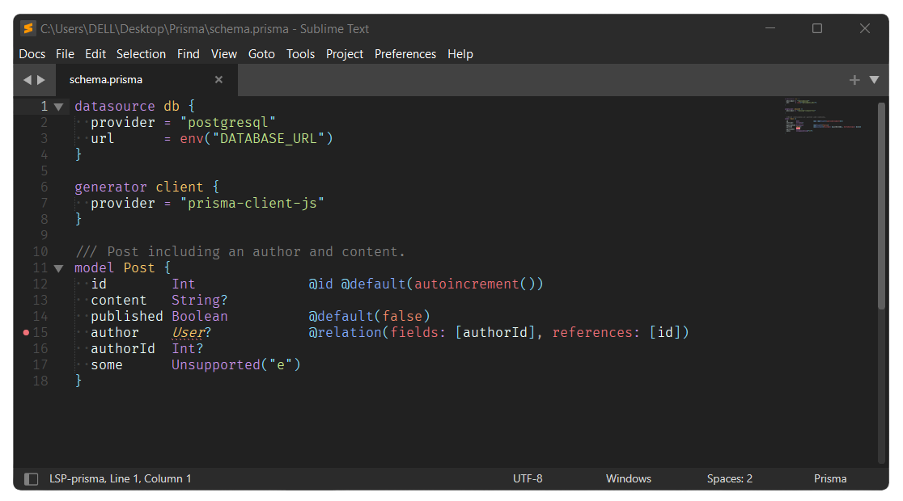

# PrismaHighlight

  

A Sublime Text package that offers enhanced syntax highlighting for [Prisma schema](https://www.prisma.io/docs/concepts/components/prisma-schema) files. Read more for the full documentation.

## Features

- Enhanced syntax highlighting for prisma schema files.
- Quickly navigate through models, enums, types etc. defined in your schema files using `Goto Symbol`.
- Ability to comment using the standard key bindings.

## Installation

#### Package Control
This package is not available on Package Control. To install it, use the following instructions.

Once you have `Package Control` installed, use `Package Control: Add Repository` from the command palette. Copy the github url (without the `.git` at the end) and enter it into the input panel that pops up at the bottom when you select `Package Control: Add Repository`. Now use `Package Control: Install Package` and search for `PrismaHighlight` and install it.

## Documentation

### How to use this package ?

By default, this package will provide syntax highlighting for any file with `.prisma` as the extension.

## Reporting issues.

There is always scope for improvements, so please do report any bug(s) that you encounter.

Please follow the issue template that has been setup while reporting any bug(s) (So as to stay as organised as possible).

## Acknowledgements.

The [syntax_test.yml](https://github.com/Sublime-Instincts/PrismaHighlight/.github/workflows/syntax_test.yml) is taken & used (with some modifications) from the official [Packages](https://github.com/sublimehq/Packages) repository. So full credit goes to them for it.

## License
The MIT License (MIT)

Copyright 2022 &copy; Ashwin Shenoy

Permission is hereby granted, free of charge, to any person obtaining a copy of this software and associated documentation files (the "Software"), to deal in the Software without restriction, including without limitation the rights to use, copy, modify, merge, publish, distribute, sublicense, and/or sell copies of the Software, and to permit persons to whom the Software is furnished to do so, subject to the following conditions:

The above copyright notice and this permission notice shall be included in all copies or substantial portions of the Software.

THE SOFTWARE IS PROVIDED "AS IS", WITHOUT WARRANTY OF ANY KIND, EXPRESS OR IMPLIED, INCLUDING BUT NOT LIMITED TO THE WARRANTIES OF MERCHANTABILITY, FITNESS FOR A PARTICULAR PURPOSE AND NONINFRINGEMENT. IN NO EVENT SHALL THE AUTHORS OR COPYRIGHT HOLDERS BE LIABLE FOR ANY CLAIM, DAMAGES OR OTHER LIABILITY, WHETHER IN AN ACTION OF CONTRACT, TORT OR OTHERWISE, ARISING FROM, OUT OF OR IN CONNECTION WITH THE SOFTWARE OR THE USE OR OTHER DEALINGS IN THE SOFTWARE.
